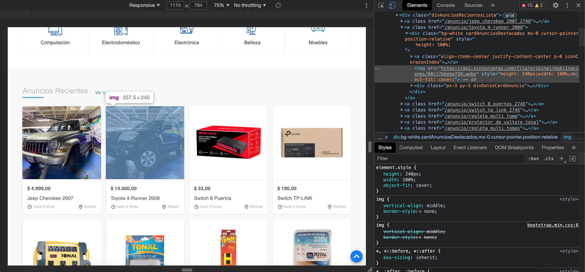
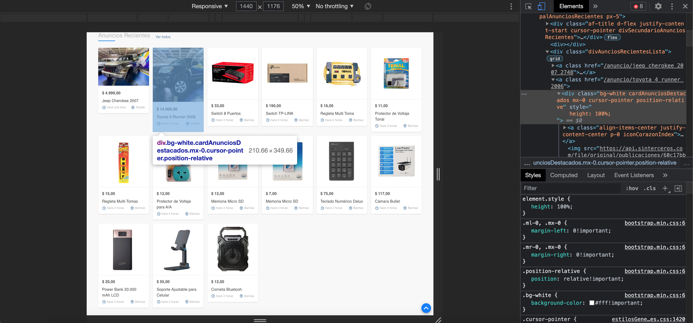
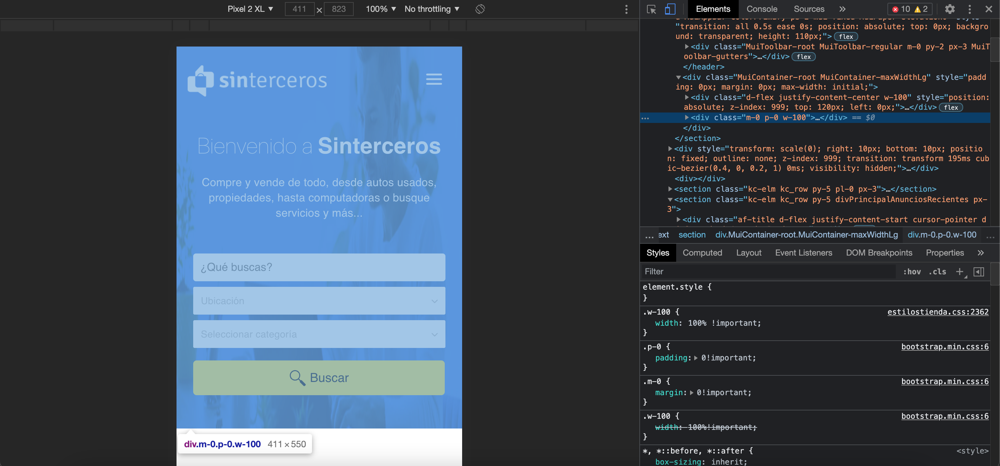
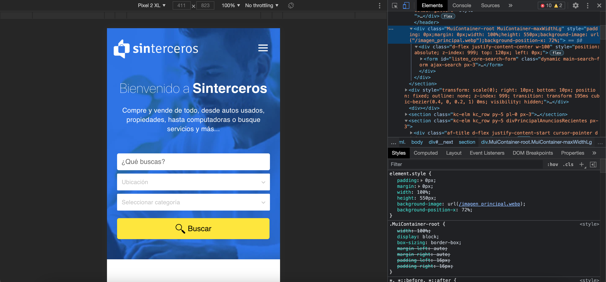
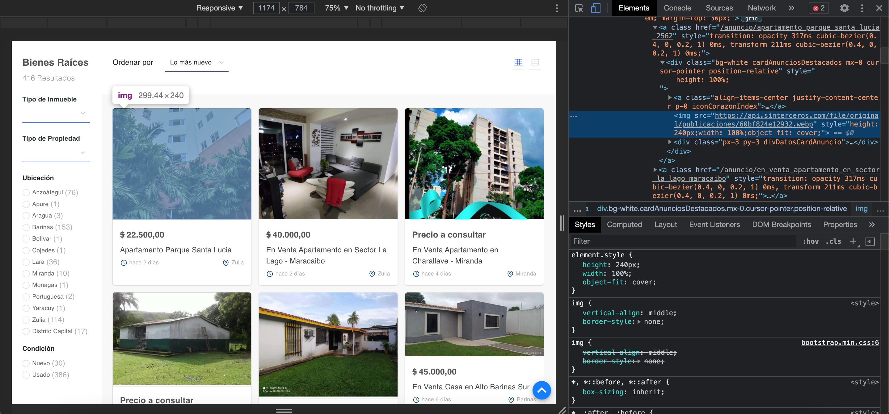
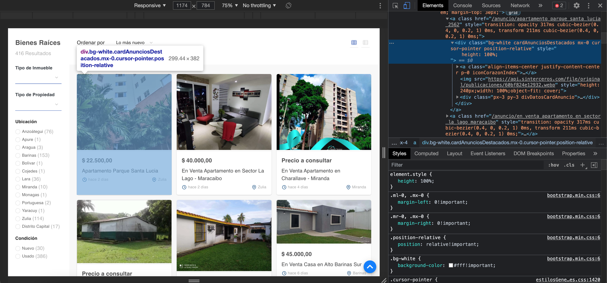
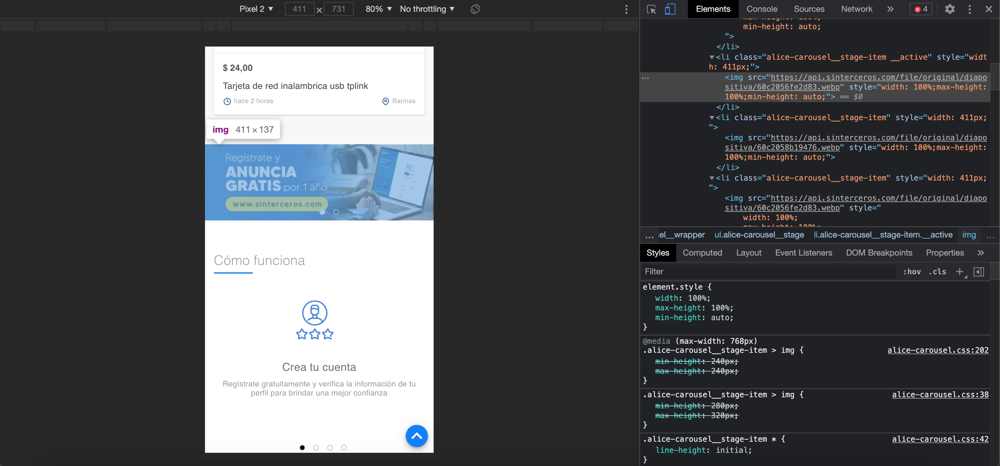
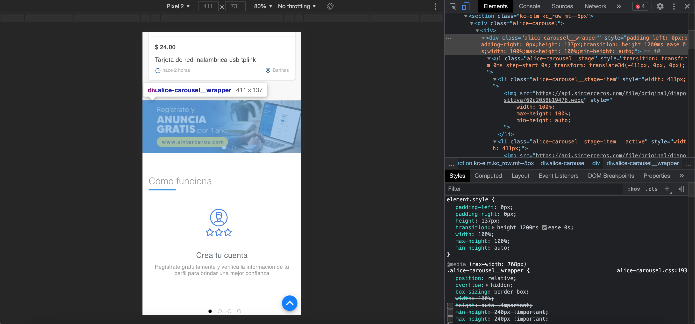

## 1- Estilos a imagenes de card:

```
{
  height: 240px;
  width: 100%;
  object-fit: cover;
}
```

Se podría jugar con el `height` para conseguir el alto perfecto.



## 2- Estilo para `height` fijo en cards

```
{
  height: 100%;
}
```

Es para el `div` dentro de la etiqueta `a` principal.



## 3- Corregir imagen del header

<p style="background-color:#FC4D4D;color:white;">Este cambio es responsive, solo es para tablets y télefonos.</p>

Para corregir que se vea la imagen estirada, la pase de una `img` a un `background-image`, asi que primero tuve que eliminar el siguiente `div`:



Y luego al `div` padre que del `div` que se eliminó colocarle estos nuevos estilos:

```
{
  padding: 0px;
  margin: 0px;
  width: 100%;
  height: 550px;
  background-image: url(/imagen_principal.webp);
  background-position-x: 72%;
}
```



## 4- Estilo para `height` fijo en cards en la página de búsqueda

Los mismos estilos que tuvo el card de la correción 1 y 2, son los necesarios para resolverlos acá también, quedarían de la siguiente forma:

Los estilos en la `img`:



Los estilos en el `div`:



Y ya todo es cuestión de jugar con el height de la imagen para una mejor vista del producto en cualquier resolución de pantalla.

## 5- Fix banner images

<p style="background-color:#FC4D4D;color:white;">Este cambio es responsive, solo es para tablets y télefonos.</p>

Para que las imagenes tengan el height que deben simplemente hay es que deshacerce de los `max-height` y `min-height`

```
{
  width: 100%;
  max-height: 100%;
  min-height: auto;
}
```

Se agregarían esos estilos a los styles de la siguiente etiqueta `img`:



Y se agregarían esos estilos también a los styles del siguiente `div`:


